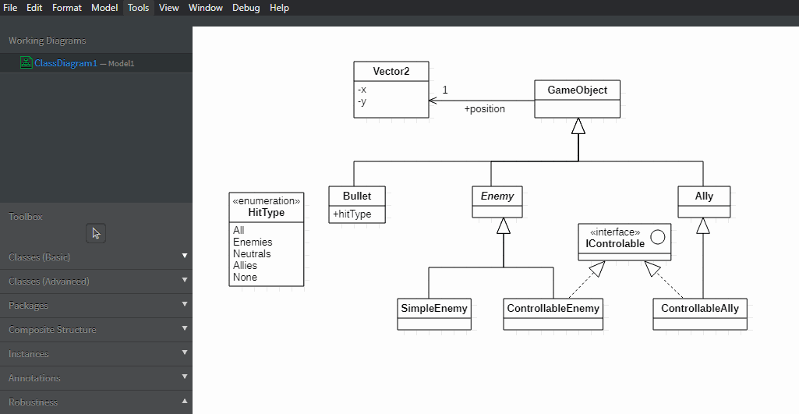

# EasyColor Extension

EasyColors is an extension that allows you to easily manage and change colors on your charts.
It makes easier to set your color preferences, and shares same colors between collaborators.
It also allows to recolor your diagrams in 2 clicks.

For a colorful engineeringworld !

# How to use

There are few commands in Tools->EasyColors:
- "Set color preferences": Change your colors preferences in StarUML to colors choiced by the extension.    
Use it carefully if you don't want to lost your colors preferences.
- "Reset color preferences": Put all your colors settings on default.
- "Apply preferences on diagram": Change the color of all elements of the diagram according to your preferences.

# Diagram color examples

## Class diagram

## Flowchart diagram

## UseCase diagram

## Activity diagram

## Component and deployment diagram

# Work in progress
- Make themes
    - default theme
    - dark theme
    - others ?
- Save color preference before changes
- Change multiples tags color with a selection
- Apply different color depending of the item attributes (exemple: make abtract class a little darker)