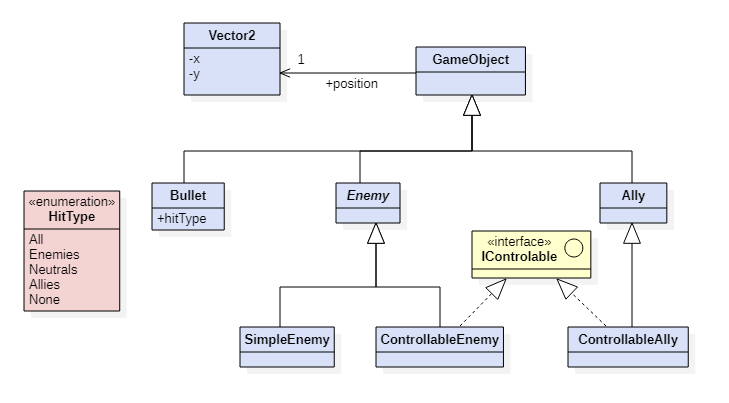
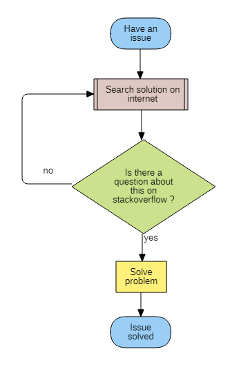
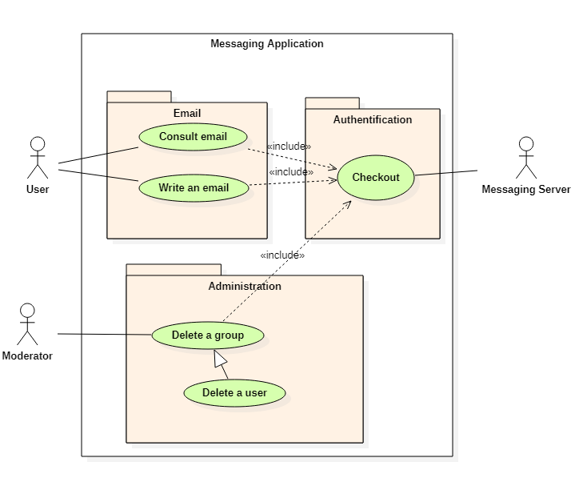
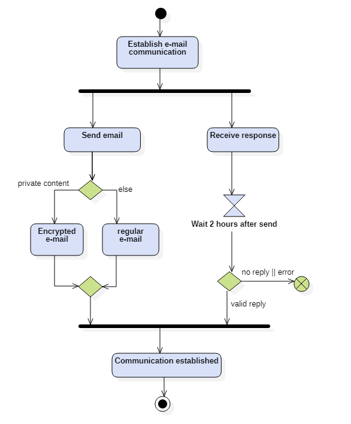
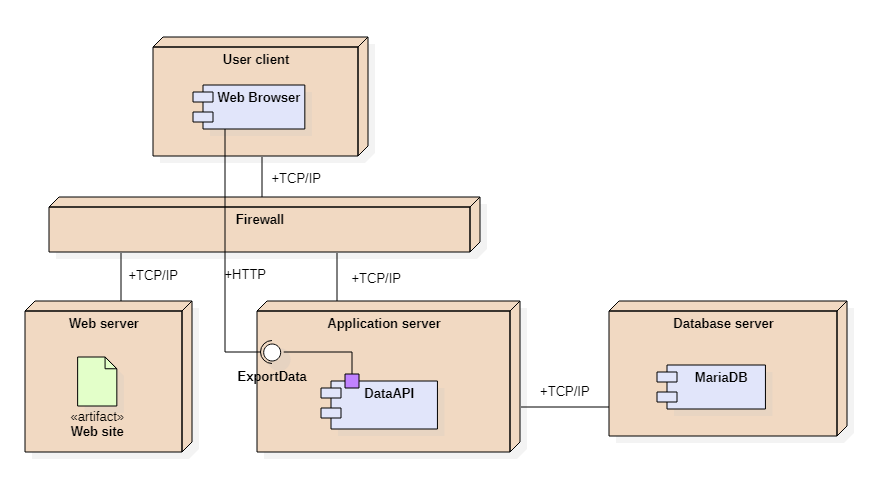

# EasyColor Extension

EasyColor is an extension to manage easily colors in your diagrams.
It makes easier to set your color preferences, and shares same colors between collaborators.
It also allows to recolor your diagrams in 2 clicks. (work in progress)

For a colorful engineeringworld !
I recommand you to makes backup of your project before using this extension until it is released.

# Diagram examples

## Class diagram

## Flowchart diagram

## UseCase diagram

## Activity diagram

## Component and deployment diagram

# Work in progress
- Make themes
    - default theme
    - cold theme
    - others ?
- Save color preference before changes
- Change multiples tag color with a selection
- Apply different color depending of the item attributes (exemple: make abtract class a little darker)